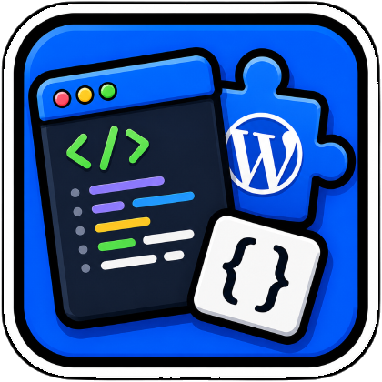

<p align="center"></p>

# WP_Snippets

[🇫🇷 FR](README.md) · [🇬🇧 EN](README_en.md)

✨ Collection de snippets WordPress orientée productivité admin, publication et workflows éditoriaux.

## ✅ Fonctionnalités
- Base de snippets prête à l’usage dans `snippets/canonical/`.
- Historique et variantes dans `snippets/archive/`.
- Workflow de sync WordPress via `CODE_SNIPPETS_SYNC/`.
- Nouveau snippet d’export RAG: un fichier Markdown par article (ZIP).
- **Calendrier V26** avec featured images, drag & drop, réallocation brouillons dès aujourd'hui et vérification des articles planifiés (créneaux 10h, 14h, 11h, 12h, 13h). La réallocation démarre désormais à **aujourd'hui** et respecte la capacité partagée publish+future+draft (max `articles_per_day` par jour). Les créneaux déjà passés sont automatiquement filtrés.
- **Calendrier V28** — Ajout d'une **notification flottante permanente** en haut à droite de l'admin WordPress qui indique en temps réel combien d'articles manquent pour atteindre l'objectif du jour (5 par défaut). Si 3 articles sont prévus, la notif affiche « Manque 2 articles — 3/5 prévus » avec lien direct vers le calendrier. La notif est présente sur **toutes les pages admin**, peut être repliée en pastille, pulse si quota non atteint, et s'auto-refresh toutes les 60s (ou au retour sur l'onglet).
- **Sous-menu « Articles planifiés »** dans la barre latérale gauche, sous le menu Articles, avec badge du nombre d'articles planifiés.
- **Détection des articles sans image mise en avant** — filtre dans la liste, sous-menu « Sans image » avec compteur, et page dédiée listant les articles publiés sans featured image.
- **FAB stack `v19`** — un bouton flottant latéral (droite par défaut) déploie au survol une colonne d'items à largeur unique : Google News, ligne « Articles programmés » **cliquable vers le futur site** (mini-jauge 18px + nombre + date), Statistiques (compteur live), Ko-fi, Newsletter (lien `/newsletter/`), « Lire en diaporama » (déclenche l'overlay de News Diaporama v3 — son bouton play bleu est masqué) et le switcher GTranslate intégré à la géométrie exacte des items. **Burger en icônes officielles iconmonstr** (`layer-multiple-alt-filled` ↔ `cube-filled`, **30px**) qui **se morphent réellement via GSAP MorphSVGPlugin** (gratuit sur cdnjs, 3.13.0) à chaque ouverture/fermeture — `mdhub_render` en wp_footer priorité 99 pour s'exécuter après le chargement de GSAP ; **animation garantie dans tous les cas** : avec GSAP, morph du path (0.7 s, ease élastique) + rotation 180° du badge ; sans GSAP (optimiseurs WP Rocket/Autoptimize/Rocket Loader), spin CSS avec échange de forme à mi-course — plus jamais de saut sec ; **poignée ⇄ collée au burger** pour basculer gauche↔droite. **Toast promotionnel large** (min 300px, z-index au-dessus du GTranslate mais sous la stack déployée, plus de fond blanc sur le wrapper GT) : tirage **sans répétition** (Fisher-Yates persisté) — cliquable, auto-masqué après 10 s, fermable (silence 30 min). Le hub délègue chaque élément à son script dédié : News Diaporama v3, Scroll To Top v2, Live Cursors, Site Stats Page, Social Ego v2, Futur Menubar v4. Voir `snippets/canonical/FRONTEND 🌸 FAB - Hub Flottant - v17.php`.
- **Futur site `v4`** — aperçu des articles programmés sur `/?future_site=1` (home avec les articles `future` inclus + bandeau « 🚀 version spoiler »). Accès : admins **ou** comptes avec un rôle premium (`$FS_PREMIUM_ROLES`, ajustable + filtre `fs_futur_premium_roles`). Les non-abonnés voient un **paywall** avec CTA vers `/abonnement/`. Admin : sous-menu Articles > Futur site + icône fusée dans la barre d'admin. Entrée publique : ligne « Articles programmés » du FAB v19. Voir `snippets/canonical/🧭 ADMIN MENUBAR - Futur Menubar - v4.php`.

## 🧠 Utilisation
1. Ouvrir et éditer les snippets dans `snippets/canonical/`.
2. Importer un snippet dans WordPress (plugin Code Snippets / WPCode).
3. Activer le snippet puis tester dans l’admin WordPress.

### Export RAG (nouveau)
- Fichier: `snippets/canonical/🧰 UTILITIES - Admin Export Posts Markdown RAG - v1.php`
- UI: bouton `Export Markdown (RAG)` dans `wp-admin > Articles`.
- Sortie: `wp-posts-rag-YYYY-MM-DD.zip`
- Contenu ZIP:
  - 1 fichier `.md` par article (`YYYY-MM-DD__slug__id-123.md`)
  - `INDEX.md` (index global des fichiers)
- Métadonnées incluses: date, auteur, catégories, tags, keywords, excerpt, URL, statut, etc.

### Calendrier V28 (Schedule Calendar)
- Fichier: `snippets/canonical/ADMIN 📅 SCHEDULER - Calendar - v28.php`
- UI: Menu bar « Calendrier » dans l'admin WordPress + badge de version dans le titre.
- **Notification flottante permanente** en haut à droite de l'admin WordPress (toutes pages admin), indique en temps réel le quota d'articles du jour (objectif 5 par défaut). Ex: « Manque 2 articles — 3/5 prévus » avec lien direct vers le calendrier. La notif peut être repliée en pastille (persistant par navigateur), pulse si quota non atteint, et s'auto-refresh toutes les 60s.
- **Featured images** en miniature dans les cartes (bordure rouge + 🖼️ si absente).
- **Vue mensuelle stable** : navigation mois précédent/suivant, option `+1 mois` / `Année complète`.
- **Drag & Drop** : reprogrammer les articles par glisser-dépose, rebalance automatique du jour.
- **Créneaux prioritaires `10h, 14h, 11h, 12h, 13h`** : 1er article → 10h, 2e → 14h, puis 11h/12h/13h.
- **Réallocation brouillons** : bouton dédié + choix du nombre d'articles/jour (1 à 5). Par défaut: **Planifiés + brouillons** avec **5 articles / jour**, compactés dès aujourd'hui. Les articles avec image mise en avant sont traités avant ceux sans image. Les créneaux déjà pris ou passés sont filtrés automatiquement.
- **Capacité partagée** — le total publish + future + draft ne dépasse jamais `articles_per_day` par jour, **y compris pour aujourd'hui**. Un jour avec 3 publiés et `2/jour` n'acceptera qu'aucun brouillon. Un jour avec 0 publié et `2/jour` acceptera 2 brouillons (10h, 14h).
- **Boîte de résultats détaillée** avec sections diagnostic: placement des brouillons (ID + date cible) et occupation des 6 prochains jours à partir d'aujourd'hui.
- **Barre de statut** sous le header, en pleine largeur.
- **Filtres** : recherche par titre, filtrage par catégorie, sélection mois/année, détection des doublons.

### Créneau automatique dans l'éditeur
- Fichier: `snippets/canonical/ADMIN 📅 SCHEDULER - Editor Next Free Slot - v3.php`
- À l'ouverture d'un nouvel article, brouillon ou article planifié dans Gutenberg, remplace la date « immédiatement » par le prochain créneau libre du calendrier.
- Créneaux et occupation: `10h, 14h, 11h, 12h, 13h`; articles publiés, planifiés et brouillons sont pris en compte. Les créneaux déjà passés sont ignorés.
- Le sélecteur de date affiche des points sous les jours occupés : rouge pour les brouillons, vert pour les publiés et bleu pour les planifiés.

### Détection des articles sans image mise en avant
- Fichier: `snippets/canonical/ADMIN 🧰 DETECT - Missing Featured Images - v1.php`
- UI: sous-menu « Sans image » dans la colonne latérale gauche, sous le menu Articles (badge rouge = nombre d'articles sans image).
- Filtre « Avec / Sans image mise en avant » dans la liste des articles (`edit.php`).
- Page dédiée listant tous les articles publiés sans featured image, avec liens Modifier/Voir.

### Articles planifiés (Sous-menu)
- Fichier: `snippets/canonical/🧭 ADMIN MENUBAR - Scheduled Posts Submenu - v1.php`
- UI: sous-menu « Articles planifiés » dans la colonne latérale gauche, sous le menu Articles.
- Affiche un badge avec le nombre d'articles planifiés.
- Redirection propre vers `edit.php?post_status=future&post_type=post&orderby=date&order=asc`.

## ⚙️ Réglages
- Aucun réglage obligatoire pour la plupart des snippets.
- Pour l’export RAG, serveur PHP avec extension `ZipArchive` requise.

## 🧾 Commandes

### Vérification syntaxe PHP
```bash
php -l "snippets/canonical/🧰 UTILITIES - Admin Export Posts Markdown RAG - v1.php"
```

### Synchronisation WordPress

#### 1. Comparaison WordPress vs Local
Compare les snippets actifs sur WordPress avec les snippets locaux.

```bash
# Comparer les snippets actifs WordPress avec les snippets locaux
python3 scripts/compare-active-wordpress-v2.sh
```

Sortie:
- **Snippets à conserver** : actifs sur WordPress
- **Snippets à archiver** : inactifs sur WordPress
- **Snippets WordPress sans correspondance locale** : à récupérer

#### 2. Archivage des snippets inactifs
Archive les snippets locaux qui ne sont pas actifs sur WordPress.

```bash
# Archiver les snippets inactifs (déplace vers snippets/archive/)
python3 scripts/archive-inactive-wordpress.sh
```

#### 3. Récupération des snippets actifs depuis WordPress
Récupère tous les snippets actifs depuis WordPress et les place dans `snippets/canonical/`.

```bash
# Récupérer les snippets actifs depuis WordPress
source .agent/-pkwpsyncsnippets/CODE_SNIPPETS_SYNC/secrets/wp-sync.env
php .agent/-pkwpsyncsnippets/CODE_SNIPPETS_SYNC/scripts/pull_active_snippets.php \
  --site="${WP_SITE_URL}" \
  --user="${WP_SYNC_USER}" \
  --app-password="${WP_APP_PASSWORD}" \
  --output-dir="snippets/canonical"
```

#### 4. Correction syntaxe PHP
Ajoute les balises `<?php` manquantes aux fichiers PHP.

```bash
./scripts/fix-php-syntax.sh
```

### Workflow complet de synchronisation

```bash
# 1. Comparer WordPress vs local
python3 scripts/compare-active-wordpress-v2.sh

# 2. Archiver les snippets inactifs
python3 scripts/archive-inactive-wordpress.sh

# 3. Récupérer les snippets actifs depuis WordPress
source .agent/-pkwpsyncsnippets/CODE_SNIPPETS_SYNC/secrets/wp-sync.env
php .agent/-pkwpsyncsnippets/CODE_SNIPPETS_SYNC/scripts/pull_active_snippets.php \
  --site="${WP_SITE_URL}" \
  --user="${WP_SYNC_USER}" \
  --app-password="${WP_APP_PASSWORD}" \
  --output-dir="snippets/canonical"

# 4. Nettoyer la syntaxe PHP si nécessaire
./scripts/fix-php-syntax.sh
```

## 📦 Build & Package
- Génération import JSON via `CODE_SNIPPETS_SYNC/`.
- Import WordPress recommandé: `CODE_SNIPPETS_SYNC/imports/IMPORT-WORDPRESS.json`.

## 🧪 Installation
1. Installer/activer `Code Snippets` (ou WPCode) sur WordPress.
2. Coller/importer le snippet souhaité.
3. Activer puis vérifier dans l’interface admin.
